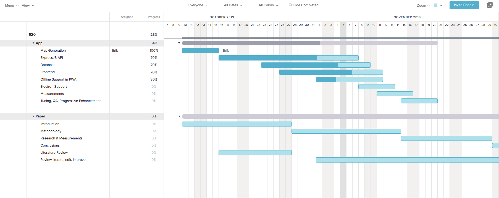

### Newly completed tasks:

- [x] Hook up sequelize and database (95%)
- [x] Link frontend with backend
- [x] Hooked up nodemon
- [x] Environment variables with .env

## Struggles

- [x] Generating temporary directories in server for public assets
- [x] Overcame cors errors
- [x] Researched react hooks and began implementing
- [x] Dealing with a few setup issues with PostGres

### Accomplished milestones:

- [x] First map generated using API

### Upcoming tasks:

- [ ] Save generated maps in database
- [ ] UI Work with react hooks
- [ ] PWA Work
- [ ] Electron work

https://www.codementor.io/engineerapart/getting-started-with-postgresql-on-mac-osx-are8jcopb
https://reactjs.org/docs/hooks-overview.html

